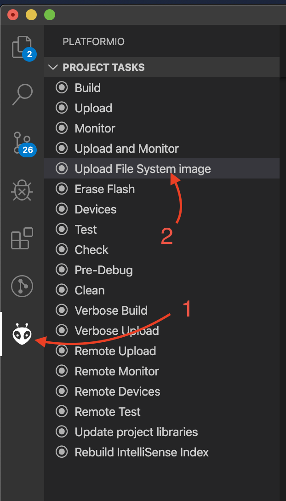

# Web Settings Primer

Hey guys. This is the settings primer you asked for. Most of the things are commented in code.

Basically, you can specify a wifi that the ESP connects to or connect to the SoftAP generated by the ESP. If you connect to the SoftAP you should get the captive portal popup immediately.

## Uploading files
To upload file system, click the PlatformIO logo then select `Upload File System Image"

## Separating source files
I put all the captive portal stuff in `captivePortal.h` so you can see how that works